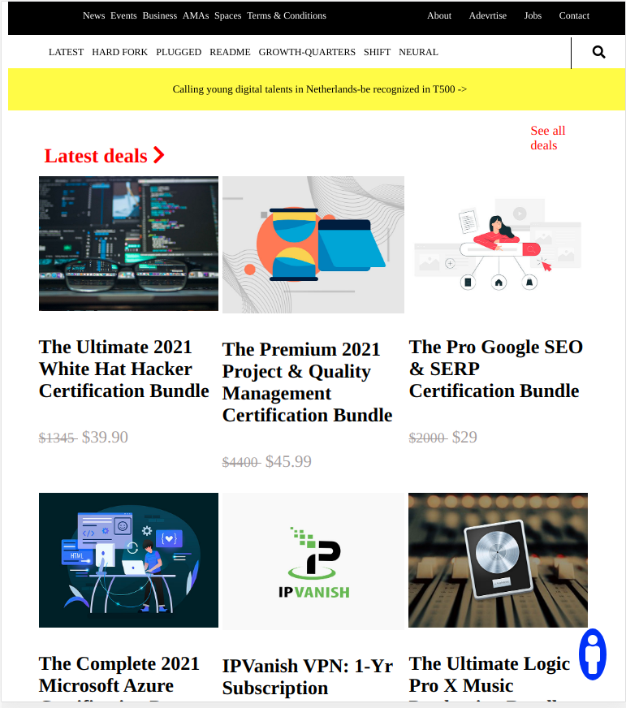

# Project Name Next-Web

> This is a replica of the The Next Web website putting emphasis on how it behaves differently depending on the size of the screen where the website is rendered.

## Built With

- Major languages: HTML & CSS

## Live Demo

[Live Demo Link](https://addis0943.github.io/The-Next-Web/)

### Prerequisites

- Computer
- Internet Connection
- basic Knowledge of Html and css

### Setup

- Vs Code
- Git
- github

### Install

- VS code
- Git
- Github

## To get local copy up and running follow these simple example steps

- git clone https://github.com/Addis0943/The-Next-Web
- cd The-Next-Web
- git checkout -b

### Linters.

Install some dependencies by running the following command

npm install --save-dev stylelint@13.3.x stylelint-scss@3.17.x stylelint-config-standard@20.0.x stylelint-csstree-validator

Run the following command to check linters

npx stylelint "\*_/_.{css,scss}"

### Deployment

Install and run a live server plugin on your Text editor.

## Authors

👤 **Author1**

- GitHub: [@githubAddis0943](https://github.com/Addis0943) -[LinkedIn](https://www.linkedin.com/in/addis-belete-134b98191/)

👤 **Author2**

- Github: [@githubJulianaOsemeke](https://github.com/JulianaOsemeke) -[LinkedIn](https://ng.linkedin.com/in/juliana-osemeke)

👤 **Author3**

- GitHub: [@KabohaJeanMark](https://github.com/KabohaJeanMark) - LinkedIn: [[LinkedIn]](https://www.linkedin.com/in/jean-mark-kaboha-software-engineer/)

## 🤝 Contributing

Contributions, issues, and feature requests are welcome!

## Show your support

Give a ⭐️ if you like this project!

## Acknowledgments

- Hat tip to [Microverse](https://www.microverse.org/) for their readme template

## 📝 License

This project is [MIT](https://opensource.org/licenses/MIT) licensed.
